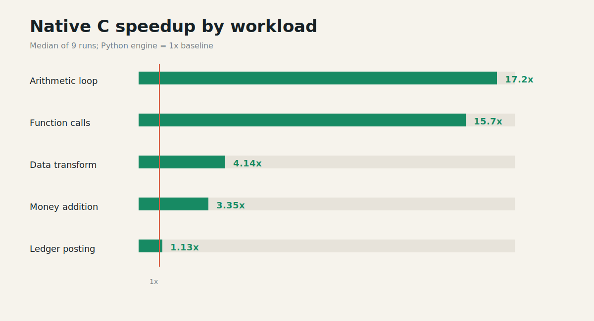
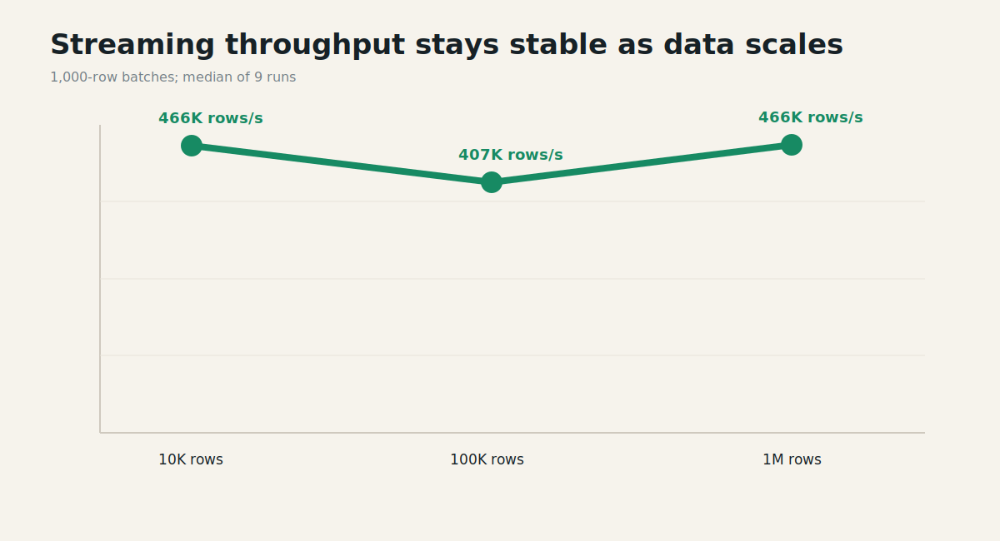

# Mellow 2.8.0 Native C Benchmark

Date: 2026-06-14  
Platform: Windows 11, Python 3.14.3  
Method: median of 9 runs per benchmark

## Executive summary

Native C is suitable as the default engine for Mellow's stable runtime scope.
It delivers the largest gains in dispatch-heavy workloads while preserving an
explicit Python fallback for unsupported paths.

- Arithmetic loop: **17.2x faster**
- Function calls: **15.7x faster**
- Data transform: **4.14x faster**
- Money addition: **3.35x faster**
- Ledger posting: **1.13x faster**
- Native transform throughput: **10.13 million rows/s**
- Streaming throughput at 1 million rows: **466,126 rows/s**



## Release confidence

Local release gates passed:

| Suite | Result |
|---|---:|
| Core semantics | 21 / 21 |
| Native parity | 14 / 14 |
| Mellow UI framework | 7 / 7 |
| Runtime contract | 7 / 7 |
| Total targeted tests | 49 / 49 |

GitHub Actions run
[27486770378](https://github.com/seashyne/mellow-programming-language/actions/runs/27486770378)
passed on Python 3.11, 3.12 and 3.13.

The earlier CI failure was not a native-core regression. The workflow invoked
`setup.py` directly on environments without `setuptools`. Commit `7128066`
now builds through the `pyproject.toml` backend and verifies
`mellowlang._mellowvm` before running tests.

## Runtime results

| Workload | Python | Native C | Speedup |
|---|---:|---:|---:|
| Arithmetic loop | 59.6K iter/s | 1.02M iter/s | 17.2x |
| Function calls | 29.0K calls/s | 453.9K calls/s | 15.7x |
| Money addition | 24.4K ops/s | 81.6K ops/s | 3.35x |
| Ledger posting | 1.95K tx/s | 2.21K tx/s | 1.13x |
| Data transform | 2.45M rows/s | 10.13M rows/s | 4.14x |

The variation matters: removing interpreter dispatch is highly effective for
tight loops and calls, but host-bound ledger work leaves less VM overhead to
remove.

## Streaming scale



| Input | Median time | Throughput |
|---|---:|---:|
| 10K rows | 0.0215 s | 465,951 rows/s |
| 100K rows | 0.2456 s | 407,235 rows/s |
| 1M rows | 2.1453 s | 466,126 rows/s |

Throughput remains broadly stable as input size grows with 1,000-row batches.

## Front-end costs

- Compile 250 lines: **40.6 ms** or **6,150 lines/s**
- CLI cold startup: **329.9 ms**

The next performance work should profile imports, parser/compiler phases,
memory use, binary size and host API batching. A faster opcode loop alone will
not remove startup or I/O costs.

## Reproduction

```powershell
python benchmarks/language_runtime_benchmark.py --repeats 9
python benchmarks/native_data_transform_benchmark.py --rows 1000 --rounds 250 --repeats 9
python benchmarks/data_core_benchmark.py --rows 1000000 --batch-size 1000 --repeats 9
```

Raw JSON and individual timing samples are available in `raw/`.
